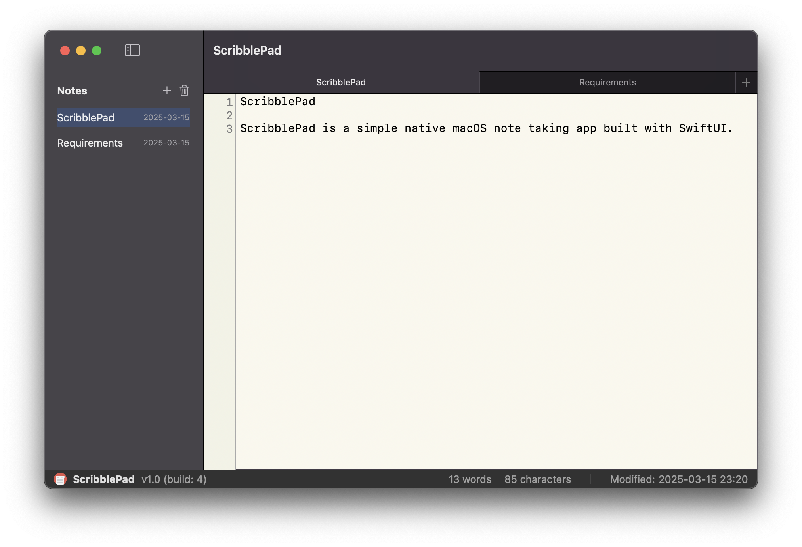

# ScribblePad

[](https://github.com/tomasliubinas/ScribblePad/actions/workflows/swift.yml)


ScribblePad is a simple native macOS note taking app built with SwiftUI.



## Requirements

- macOS 13.0 or later
- Xcode 15.0 or later
- Swift 5.8 or later

## Installation

1. Clone the repository:
```bash
git clone https://github.com/tomasliubinas/ScribblePad.git
```

2. Open the project in Xcode:
```bash
cd ScriblePad
open ScriblePad.xcodeproj
```

3. Build and run the project in Xcode (⌘+R)

## Testing

- Run unit tests: ⌘+U in Xcode
- UI tests are in the ScribblePadUITests directory

## License

This project is licensed under the MIT License - see the LICENSE file for details.
